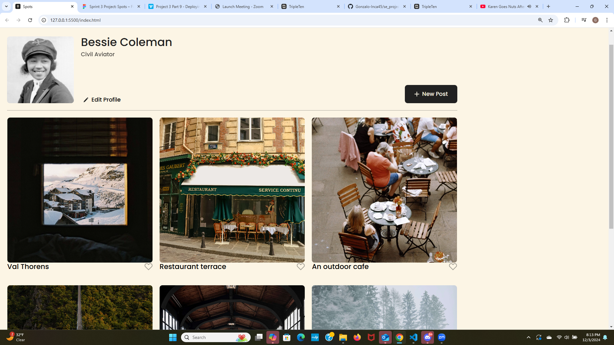

# Project 3 "Spots"

An image sharing site.

## Description

On this project I created an interactive social media web application where users can add and remove photos, like photos of other users on the site, and also allowing the user to create changes to their profie.

## Tech Stack

-HTML
-CSS
-Responsive Design

## Deployment

Link to live view: https://gonzalo-inca45.github.io/se_project_spots/

<img src="./images/mobile.view.png" width= "720"

## Video

[Project Video](https://drive.google.com/file/d/1B8EVVrl4KI9CUj3HhywDi-e7xhdPC-2z/view?usp=drive_link)
